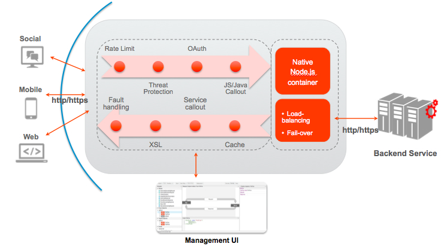
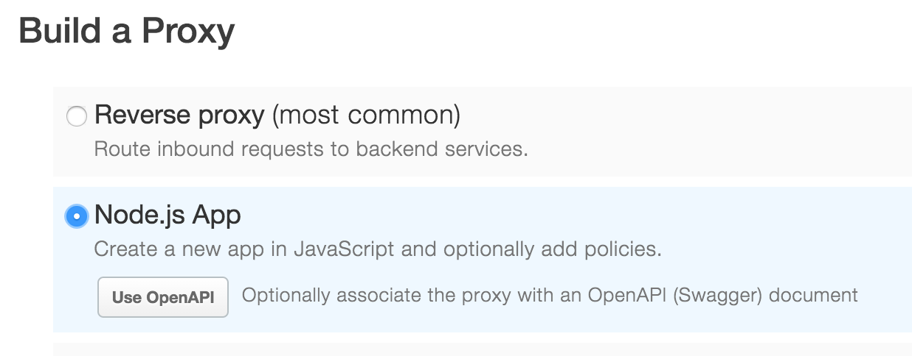
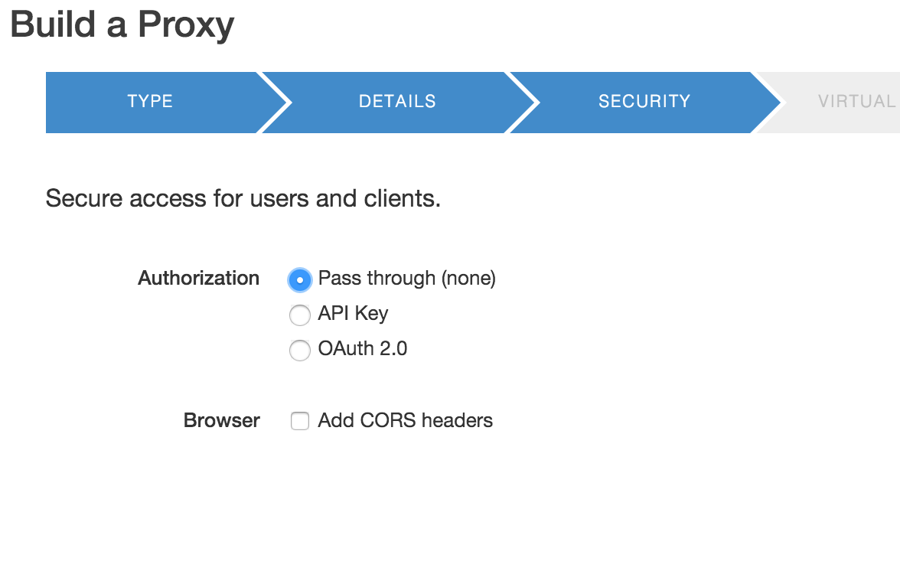
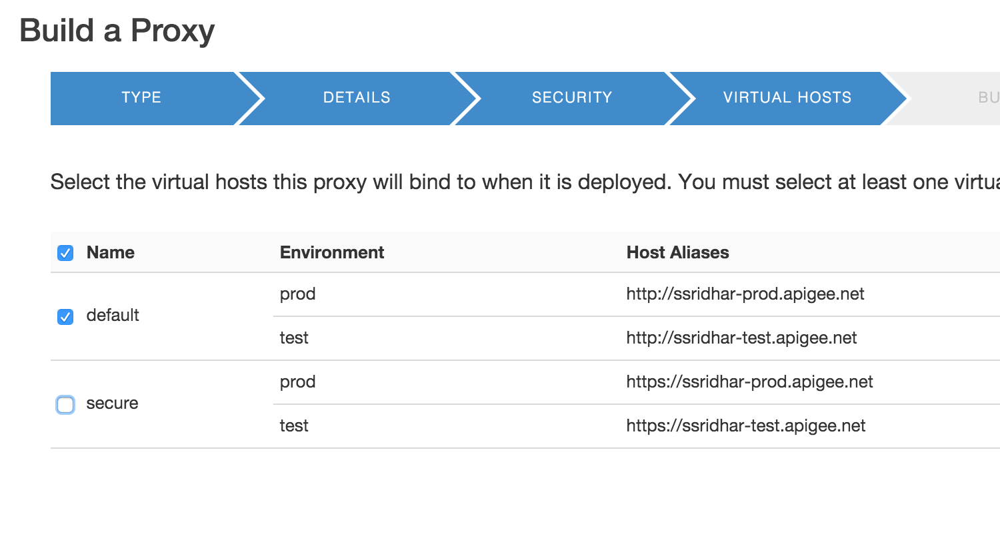
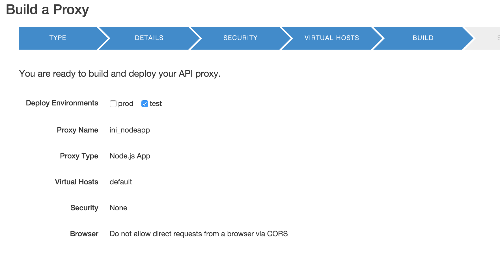
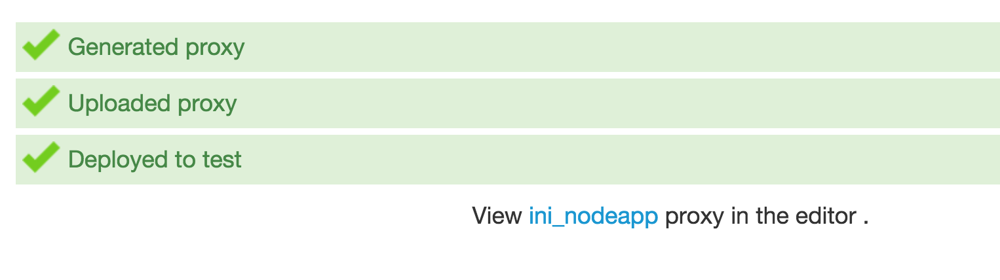
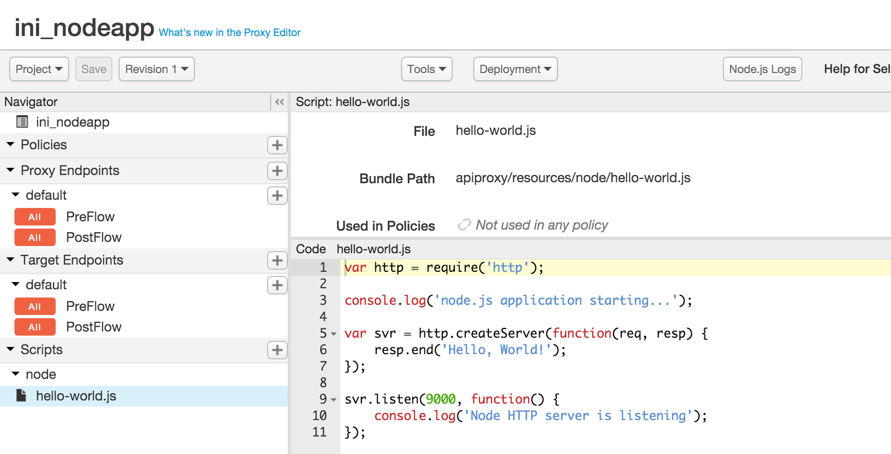
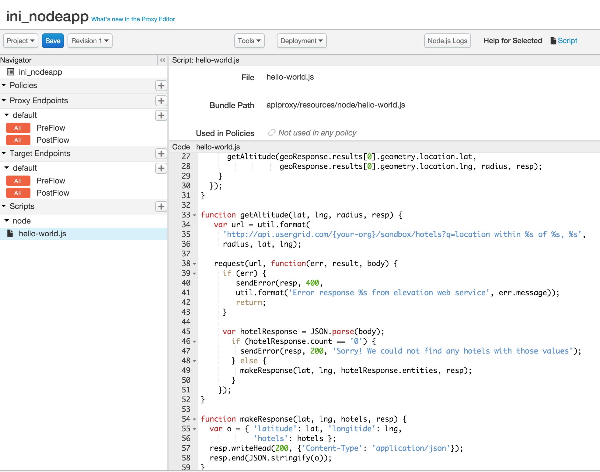

{width="8.5in" height="1.3888888888888888e-2in"}

**Appendix 5 - Building APIs using Node.js**

{width="6.5in" height="2.861111111111111in"}

**Overview**

In this lab see how Edge supports programmability with Node.js. Running
on Edge, Node.js apps take advantage of Edge's enterprise-grade cloud
operations like traffic management, security, deployment tools, revision
control, logging, and analytics. Furthermore, you can leverage thousands
of third-party Node.js modules in your APIs.

{width="4.567708880139983in"
height="2.5986165791776026in"}

Enterprise developers have found many creative ways to integrate Node.js
applications into the Edge platform. Some common use cases include:

-   Build highly customized standalone APIs and backend services.

-   Build backend logic for API BaaS to leverage cloud data storage and
    > management, user management, push notifications, and more.

-   Solve complex orchestration and mobile optimization problems using
    > Apigee policies with the advantage of a scriptable
    > target endpoint.

-   Build composite services and mashups.

-   Rapidly develop prototypes of new APIs using frameworks like
    > Express, Argo, and Usergrid.

**Section Objectives**

The goal of this section is to get you familiar with using a node.js
application within Apigee Edge. To illustrate this better, we will
implement a composite (mashup) API in node.js and deploy in Apigee. You
can think of node.js apps deployed on Apigee Edge as programmable
targets. In this sample, the node.js code orchestrates calls to the
Google geolocation APIs, Apigee BaaS data store, executes custom logic,
and returns appropriate responses.

**Note**: Now that you are familiar with the Apigee Edge Management UI
navigation, the instructions will become terse and will be provided
without screenshots unless a new concept is being introduced. If you are
new to node.js, there are many excellent learning resources available
online including books, videos, blogs, and the nodejs.org
[*website*](https://nodejs.org/en/). From this point on, we assume you
are familiar with Node.js and are exploring how to integrate node.js
apps with Apigee Edge.

**Estimated Time: 15 mins**

1)  **Creating an API Proxy** for a node.js backend that you want to
    > expose requires you to provide host the application in Apigee.

    a.  Open up a browser tab and log in to http://enterprise.apigee.com

    b.  From the Organization drop-down in the top-right corner, select
        > the organization assigned to you.

    c.  From the Environment drop-down, select ‘test’

    d.  From the main menu, select APIs → API Proxies

> {width="3.1041666666666665in"
> height="0.9496041119860017in"}

a.  To create a new API proxy, select the + API Proxy button to add a
    > new proxy.

b.  On the New API Proxy form that is displayed, provide information
    > needed to generate an API proxy and click next.

> {width="5.661458880139983in"
> height="2.2211264216972877in"}

a.  Enter the details for your node.js proxy and click next

> {width="5.526042213473316in"
> height="3.4094969378827646in"}
>
> Starting Point Type: **New Node.js**
>
> Node.js Server Type : **Node.js Simple “Hello World”**
>
> Name: **{your\_initials}\_nodeapp**
>
> Project Base Path: **/v1/{your\_initials}\_nodeapp**
>
> **Note**: Replace **{your-initials}** with the actual initials.
>
> **Example:** If you name is ‘John Doe’, your API proxy name would be
> ‘jd\_mashup’.

a.  Do not enable security on the proxy and click next.

> {width="5.651042213473316in"
> height="3.5816458880139983in"}

a.  Select the virtual hosts (default) to deploy the proxy and click
    > next

> {width="5.671875546806649in"
> height="3.054086832895888in"}

a.  Review the detail and click ‘build and deploy’

> {width="5.640625546806649in"
> height="3.0011012685914262in"}

a.  Once the proxy has been deployed, click on the link to open the
    > proxy

> {width="5.421875546806649in"
> height="1.5205577427821522in"}

1)  **Using an existing** node.js application that you want to expose
    > requires edit the source code.

    a.  Switch to the “Develop” tab.

    b.  Navigate to the “Scripts” section to view the sample node.js
        > source code that is created by default.

> {width="6.5in" height="3.3194444444444446in"}

a.  Replace the code by copying the source you find here:

  ------------------------------------------------------------------------------------------
  > var request = require('request');\
  > var http = require('http');\
  > var urlparse = require('url');\
  > var util = require('util');\
  > \
  > function sendError(resp, code, msg) {\
  > var o = { 'error': msg };\
  > resp.writeHead(code, {'Content-Type': 'application/json'});\
  > resp.end(JSON.stringify(o));\
  > }\
  > \
  > function geocode(postalcode, country, radius, resp) {\
  > var url = util.format(\
  > 'http://maps.googleapis.com/maps/api/geocode/json?address=%s&region=%s&sensor=false',\
  > postalcode, country);\
  > \
  > request(url, function(err, result, body) {\
  > if (err) {\
  > sendError(resp, 400,\
  > util.format('Error response %s from geocoding web service', err.message));\
  > return;\
  > }\
  > var geoResponse = JSON.parse(body);\
  > if (geoResponse.status !== 'OK') {\
  > sendError(resp, 500, 'Invalid geocode response');\
  > } else {\
  > getAltitude(geoResponse.results\[0\].geometry.location.lat,\
  > geoResponse.results\[0\].geometry.location.lng, radius, resp);\
  > }\
  > });\
  > }\
  > \
  > function getAltitude(lat, lng, radius, resp) {\
  > var url = util.format(\
  > 'http://api.usergrid.com/{your-org}/sandbox/hotels?q=location within %s of %s, %s',\
  > radius, lat, lng);\
  > \
  > request(url, function(err, result, body) {\
  > if (err) {\
  > sendError(resp, 400,\
  > util.format('Error response %s from elevation web service', err.message));\
  > return;\
  > }\
  > \
  > var hotelResponse = JSON.parse(body);\
  > if (hotelResponse.count == '0') {\
  > sendError(resp, 200, 'Sorry! We could not find any hotels with those values');\
  > } else {\
  > makeResponse(lat, lng, hotelResponse.entities, resp);\
  > }\
  > });\
  > }\
  > \
  > function makeResponse(lat, lng, hotels, resp) {\
  > var o = { 'latitude': lat, 'longitide': lng,\
  > 'hotels': hotels };\
  > resp.writeHead(200, {'Content-Type': 'application/json'});\
  > resp.end(JSON.stringify(o));\
  > }\
  > \
  > var svr = http.createServer(function(req, resp) {\
  > var parsed = urlparse.parse(req.url, true);\
  > if (!parsed.query.zipcode) {\
  > sendError(resp, 400, 'Missing query parameter "zipcode"');\
  > } else if (!parsed.query.country) {\
  > sendError(resp, 400, 'Missing query parameter "country"');\
  > }else if (!parsed.query.radius) {\
  > sendError(resp, 400, 'Missing query parameter "radius"');\
  > } else {\
  > geocode(parsed.query.zipcode, parsed.query.country, parsed.query.radius, resp);\
  > }\
  > });\
  > \
  > svr.listen(9000, function() {\
  > console.log('Node Mashup sample app is running on port 9000');\
  > });
  ------------------------------------------------------------------------------------------
  ------------------------------------------------------------------------------------------

a.  Edit the source code and replace **{your-org}** with the actual name
    > of your API BaaS organization name.

> {width="6.163110236220472in"
> height="4.859375546806649in"}

a.  Take a minute to review the code. This is an extremely simple
    > node.js application, which takes zipcode, country and radius as
    > query parameters. It calls Google’s geolocation API to determine
    > the latitude and longitude of the given zipcode and country. It
    > then uses the latitude and longitude along with radius to query
    > hotels collection in BaaS. As you may notice, we are using the
    > BaaS location query capability to filter matching hotels. Then
    > finally the code constructs a final JSON response with latitude,
    > longitude and matching hotels. Now let’s save and try to invoke
    > this API to see it working.

<!-- -->

1)  **Testing the API Proxy with the location query after deploying
    > changes**

    a.  Click on the ‘Save’ button to save and deploy the changes to the
        > ‘{your\_initials}\_mashup’ API Proxy.

    b.  Wait for the ‘Successfully saved API Proxy’ message to appear
        > and verify that your proxy is deployed to the ‘test’
        > environment

    c.  Go to the ‘Trace’ tab and start a trace session by clicking the
        > ‘Start Trace Session’ button

    d.  Use Postman to test the ‘/GET mashup’ request with the following
        > query parameters combinations and review the results being
        > returned

        -   zipcode=98101&country=US&radius=1000

        -   zipcode=98101&country=US&radius=200

        -   zipcode=94105&country=US&radius=400

        -   No query parameters

> Note : Before invoking the API, change the URL to point your API.\
> i.e. **{your\_initials}**\_mashup.
>
> Notice that the responses being returned by the API proxy for the
> various query parameter combinations are different as the location
> based query finds hotels that match the criteria.

**Summary**

You learned how to deploy an existing node.js application in Apigee Edge
and expose it as an API. You can think of using node.js with Apigee Edge
when you have some of these common problems -

-   building highly customized standalone APIs and backend services.

-   building backend logic for API BaaS to leverage cloud data storage
    > and management, user management, push notifications, and more.

-   solve complex orchestration and mobile optimization problems using
    > Apigee policies with the advantage of a scriptable
    > target endpoint.

-   building composite services and mashups.

-   Rapidly develop prototypes of new APIs using frameworks like
    > Express, Argo, and Usergrid.

**Summary**

That completes this hands-on lesson. In this lab you learned how APIs
developed with Apigee Edge can leverage the out-of-the-box, configurable
policies and custom code written in node.js. The flexibility to use
standard implementations, configuration and code improves developer
productivity by accelerating the time to solve both common and complex
problems.
