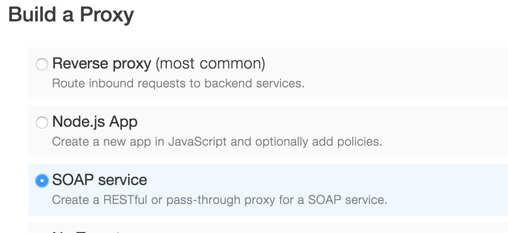
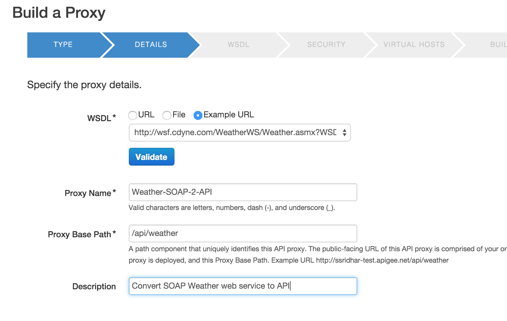
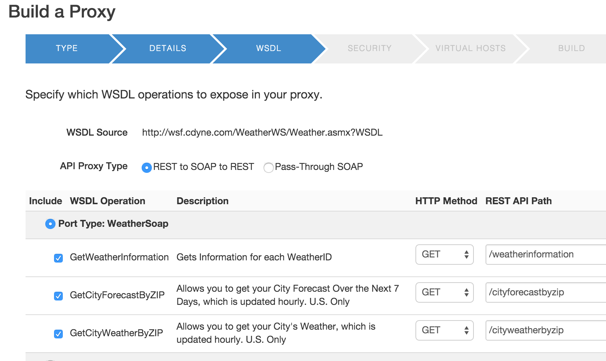
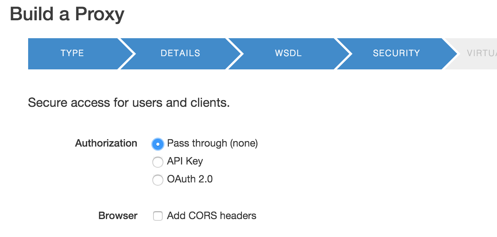
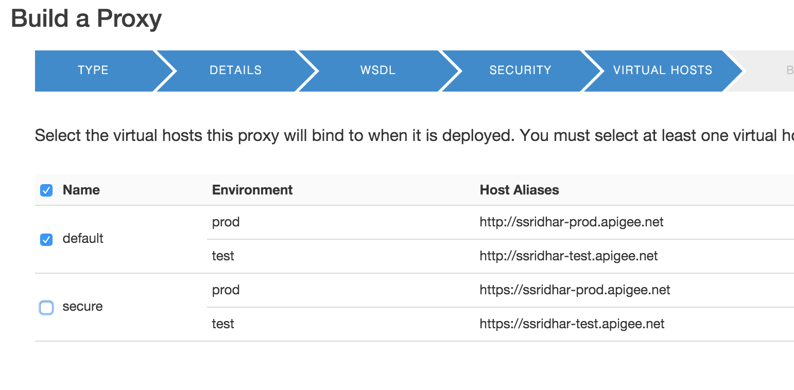
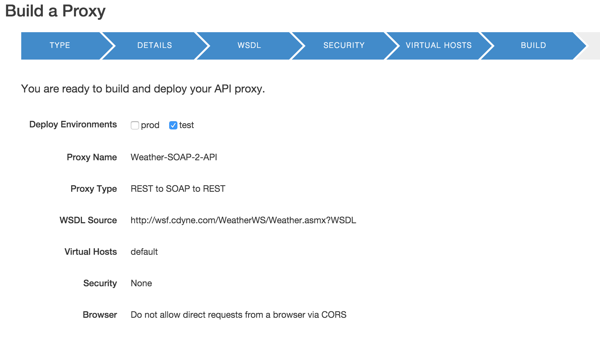
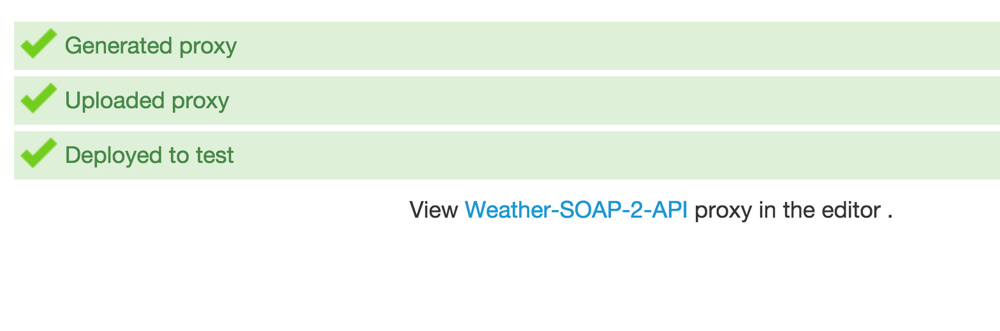
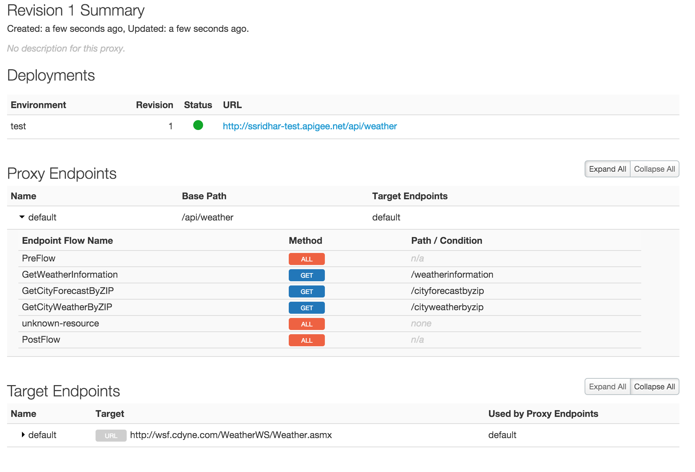

*Appendix 6 - Build APIs from Web Services*

**Overview**

This topic explains how to create API proxies for SOAP-based web
services. You can create two kinds of SOAP proxies in Edge. One
generates a RESTful interface to the backend SOAP service and the other
performs a "pass through" of the SOAP message to the backend. In this
lab you will see how to convert an existing SOAP interface to REST.

The REST to SOAP to REST option processes the WSDL to generate a RESTful
API proxy. Edge determines from the WSDL the service's supported
operations, input parameters, and so on. Edge "guesses" which HTTP
method to use for each operation. Typically, Edge translates operations
into GET requests, which have the advantage of being cacheable. Edge
also sets up the backend target endpoint, which can vary per SOAP
operation.

**Other API Policies that are helpful with SOAP Services**

***SOAP Message Validation policy***

Validates a message against an XSD schema or WSDL definition and rejects the message if it does not conform

***Inbound authentication and authorization: Validate SAML Assertion
policy***

The SAML policy type enables API proxies to validate SAML assertions
that are attached to inbound SOAP requests. The SAML policy validates
incoming messages that contain a digitally-signed SAML assertion,
rejects them if they are invalid, and sets variables that allow
additional policies, or the backend services itself, to further validate
the information in the assertion.

***Outbound token generation: Generate SAML Assertion policy***

The SAML policy type enables API proxies to attach SAML assertions to
outbound XML requests. Those assertions are then available to enable
backend services to apply further security processing for authentication
and authorization.

***XSL Transformation policy***

The XSL Transform policy applies custom [Extensible stylesheet language
transformations (XSLT)](http://en.wikipedia.org/wiki/XSLT) to XML
messages, letting you transform them from XML to another format, such as
XML, HTML, or plain text. The policy is often used to integrate
applications that support XML, but that require different XML-formats
for the same data

**Objectives**

By the end of this lesson, you will have converted an sample web service
into a RESTful API using Apigee’s SOAP to REST API Wizard.

**Prerequisites**

-   No pre-requisites

**Estimated Time : 15 mins**

1)  **Creating an API Proxy** for a backend service that you want to
    expose requires you to provide the network address for the backend
    service, along with some information that API Services uses to model
    the API that will be exposed to developers.

    -   Open up a browser tab and log in to
        [*http://enterprise.apigee.com*](http://enterprise.apigee.com)

    -   From the Organization drop-down in the top-right corner, select
        the organization assigned to you.

    -   From the Environment drop-down, select ‘test’

    -   From the main menu, select APIs → API Proxies

> 

-   To create a new API proxy, select the + API Proxy button to add a
    new proxy.

> 

-   On the New API Proxy form that is displayed, provide information
    needed to generate an API proxy. Select **SOAP Service** and click
    **Next **

> 

2)  Specify the Proxy details.

-   WSDL: Select ‘**Example URL**’.

-   Select
    ‘[*http://wsf.cdyne.com/WeatherWS/Weather.asmx?WSDL*](http://wsf.cdyne.com/WeatherWS/Weather.asmx?WSDL)’
    and click **Validate**

-   Proxy Name: {you\_initials}\_Weather2SOAPAPI
-   Proxy Base Path: /{your\_initials}/v1/weather and click **Next**

3)  Select **REST to SOAP to REST.** Select the WSDL operations to be
    exposed and click **Next**

> 

1)  Select the WSDL operations to be exposed and click **Next**

4)  Select the security to be applied (select **none**) and click
    **Next**

> 

5)  Select the virtual hosts the proxy should be deployed to and click
    **Next**

> 

6)  Select the environments the proxy should be deployed to and click
    **Next**

> 

7)  Once deployed click on the proxy name ‘**Weather-SOAP-2-API**’ proxy
    to review it

> 

8)  Expand the proxy endpoints and review the details. You will notice
    that each of the SOAP operations are exposed as API resources (ex:
    The SOAP operation GetWeatherInformation
    becomes /weatherinformation)

> 

9)  To test the API, go to your browser and try

    -   HTTP GET {proxy-endpoint}/weatherinformation

    -   To get weather for individual cities, try: HTTP GET
        {proxy-endpoint}/cityforecastbyzip?ZIP=90210

NOTE: The query parameter ‘ZIP’ is case sensitive.

**Summary**

That completes this hands-on lesson. Simple and quick, but you learned
how quickly you were able to convert an existing SOAP service into API
without writing a single line of code. Such feature are really helpful
to leverage existing SOA assets and quickly enable them for consumption
for mobile and/or HTML5 web applications.
