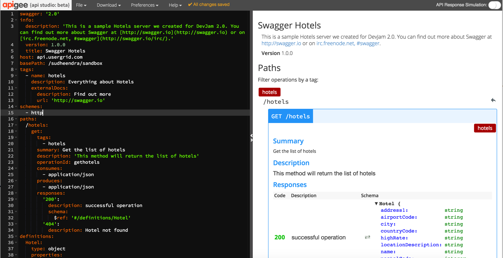
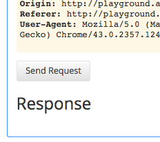
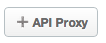
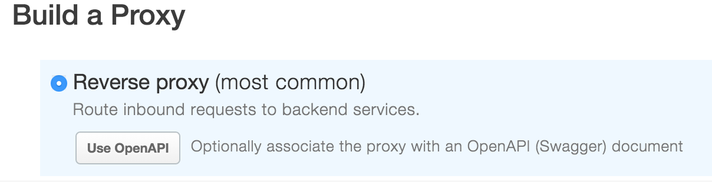
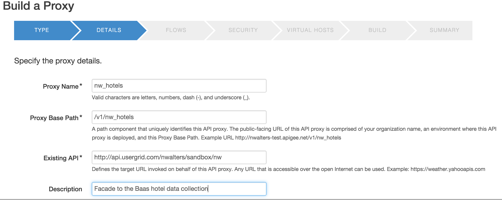
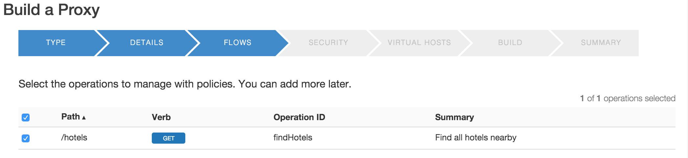
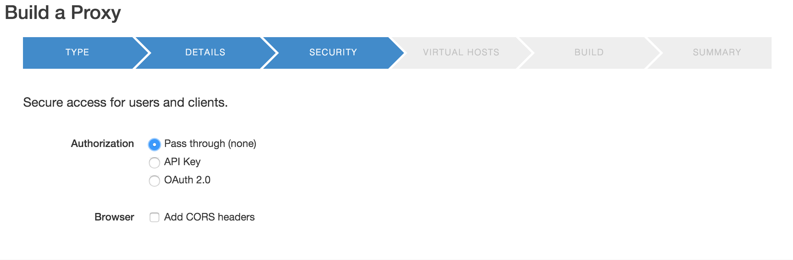
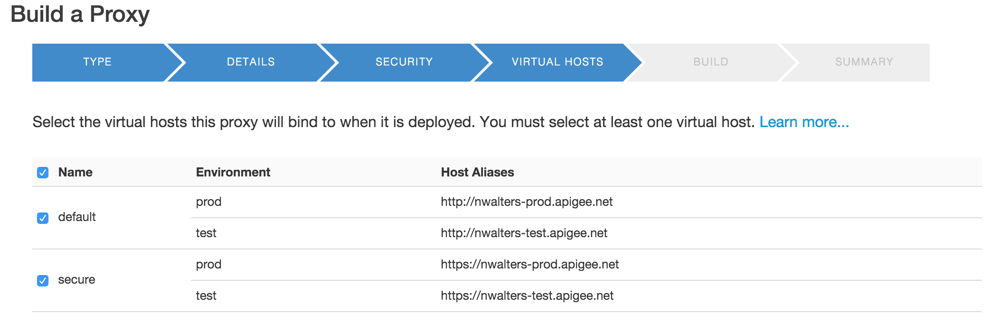
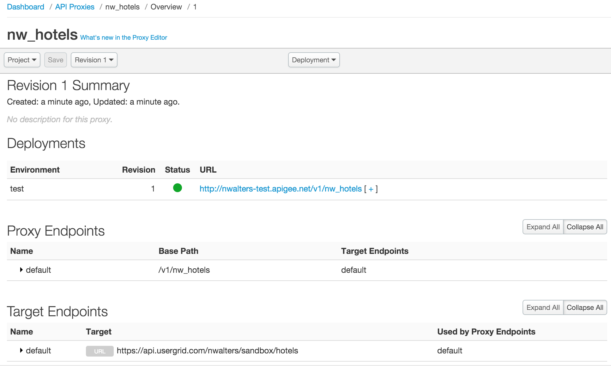

{width="8.5in" height="1.3888888888888888e-2in"}

**Lab 1 - Designing APIs using Swagger**

**Overview**

{width="6.088542213473316in"
height="2.6539796587926507in"}

An API is an interface between the provider of some backend system(s)
who wants to expose a set of services and the consumers of those
services who want to do something with them. Adherence to a “contract”
or a clear understanding of what the requests and responses should look
like, makes life easier for all participants. In order to clearly
communicate the terms of that contract, the industry has created a few
formats for describing an API, the most popular of which is called
[*Swagger*](http://swagger.io/).

{width="2.8906255468066493in"
height="1.6080293088363955in"}

By designing your API in Swagger, you allow the API developer and the
API consumer to both do their jobs and meet successfully in the middle
without unpleasant surprises.

{width="2.2156080489938756in"
height="1.7447922134733158in"}

Apigee is a key contributing member of and has partnered with a number
of other companies to help drive the Swagger spec and contribute open
source software to the community.

This is a partial list of the tools that Apigee has created,
open-sourced, or contributed to related to API-first design, Swagger, or
API deployment:

-   [*http://apistudio.io*](http://apistudio.io/) - In-browser Swagger
    IDE including live documentation, code generation, mocking, and
    cloud hosting.

-   [*https://github.com/apigee-127/a127-documentation/wiki*](https://github.com/apigee-127/a127-documentation/wiki) -
    A toolkit for modeling and building rich, enterprise-class APIs in
    Node.js on your laptop.

-   [*http://editor.swagger.io*](http://editor.swagger.io) - This editor
    is the basis for the ones used in the above two projects, but it
    also includes code generators for a number of other languages.

**Objectives**

In this lab, we will describe an API contract in Swagger and invoke the
API in the cloud. We will also see how an API contract in Swagger can be
used to create an API proxy in Apigee Edge.

**Prerequisites**

Your Apigee Edge organization name, user name, and the password. Ask
your Instructor for organization and application details.

**Estimated Time: 45 mins**

1)  **Creating a Swagger specification** can be done with Apigee-127 on
    your local machine or in the cloud at
    [*http://apistudio.io*](http://apistudio.io), since both utilize the
    same Swagger editor. For this lab, we will assume that you are using
    [*http://apistudio.io*](http://apistudio.io). Click on Get Started
    to see the editor in action.

    a.  Copy the [*Swagger YAML located
        here*](https://gist.github.com/anonymous/90f30c5870c19e7980d9).

    b.  Select the entire contents of the Swagger editor at API Studio
        in the browser and delete it. Paste the Swagger that you copied
        in its place.

    c.  On the right side of the screen you will see the generated
        documentation updated to reflect the API described by the
        Swagger that you just pasted.\
        \
        {width="5.781152668416448in"
        height="2.9739588801399823in"}

    d.  On the right side of the Swagger editor, in the documentation
        view, scroll down to the Responses section and click the Try
        this operation button:

> {width="2.901042213473316in"
> height="1.924990157480315in"}

a.  Scroll down past the request information in the yellow block, so
    that you can see the Send Request button. Click it to make an API
    request:\
    {width="2.4166666666666665in"
    height="2.1458333333333335in"}

b.  View the response below the button. Note the three tabs (Rendered,
    Pretty, and Raw) and the ability to view the Headers and Body :

{width="3.0364588801399823in"
height="2.619362423447069in"}\
\
Please expand the Body section to view the entire response.

1)  **Creating an API proxy from the Swagger specification** can be done
    very easily in Apigee Edge.

    a.  In API Studio Edit the file and change the base path to
        /**{your\_baas\_org}**/sandbox/**{your\_initials}**, and replace
        **{your\_baas\_org}** with your BaaS org.

    b.  Copy the URL from the address bar in API Studio (it will be of
        the form **playground.apistudio.io/XXXXXX/\#/)**

    c.  Open up a browser tab and log in to http://enterprise.apigee.com

    d.  From the Organization drop-down in the top-right corner, select
        the organization assigned to you.

    e.  From the Environment drop-down, select ‘test’

    f.  From the main menu, select APIs → API Proxies

{width="3.1041666666666665in"
height="0.9496041119860017in"}

a.  To create a new API proxy, select the + API Proxy button to add a
    new proxy.

{width="1.1041666666666667in"
height="0.4479166666666667in"}

a.  We are going to create a ‘Reverse Proxy’. This is the most common
    type of API Proxy and allows us to route requests to backend
    services, and we are going to do this using OpenAPI. Hit the **Use
    OpenAPI** button in the Reverse proxy section.

> {width="4.124028871391076in"
> height="1.0589227909011374in"}

a.  Paste in the URL that you copied from API Studio, replace the
    **\#/** at the end of the URL with **spec**, and hit the **Apply**
    button, and then hit the **Next** button (in the bottom left corner)

> {width="4.249354768153981in"
> height="1.3829932195975503in"}

a.  On the Build a Proxy form that is displayed, provide information
    needed to generate the API proxy

> {width="5.656287182852143in"
> height="2.2591240157480317in"}
>
> Proxy Name: **{your\_initials}\_hotels**
>
> Project Base Path: **/v1/{your\_initials}\_hotels**
>
> Existing API:
> **https://api.usergrid.com/{your-BaaS-org}/sandbox/hotels**
>
> Description: **Façade to the Baas hotel data collection**
>
> Features: **None**
>
> **Note**: Replace **{your-BaaS-org}** with the actual name of your API
> BaaS organization.
>
> **Example:** If you name is ‘John Doe’, your API proxy name would be
> ‘jd\_hotels’. We will follow this naming convention throughout the
> DevJam.

a.  Leave the defaults on the next **Flows** screen, hit **Next** to
    continue

> {width="4.998768591426072in"
> height="1.1543143044619422in"}

a.  On the next screen select **Pass through (none)** as the
    Authorization scheme and hit **Next**

> {width="4.942112860892388in"
> height="1.6240879265091863in"}

a.  Leave the defaults on the next **Virtual Hosts** screen, hit
    **Next** to continue

> {width="5.0031999125109365in"
> height="1.662665135608049in"}

a.  Ensure that the ‘test’ checkbox is ticked on the Build screen and
    hit **Build and Deploy**

> {width="4.998774059492564in"
> height="2.4165299650043743in"}

a.  Once the proxy has been deployed, click on the **view
    {your\_initials}\_hotel proxy in the editor** link

> {width="5.091265310586177in"
> height="1.5282852143482064in"}

a.  Review the information on the resulting API Proxy page

> {width="5.428132108486439in"
> height="3.2627734033245845in"}

**Summary**

That completes our first hands-on lesson. In this short lab, you learned
the fundamentals of API design, creating Swagger specification for an
API also understood how to create an API proxy in Apigee Edge from an
existing Swagger specification.
