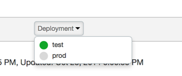
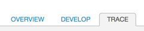
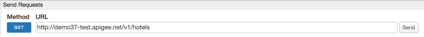
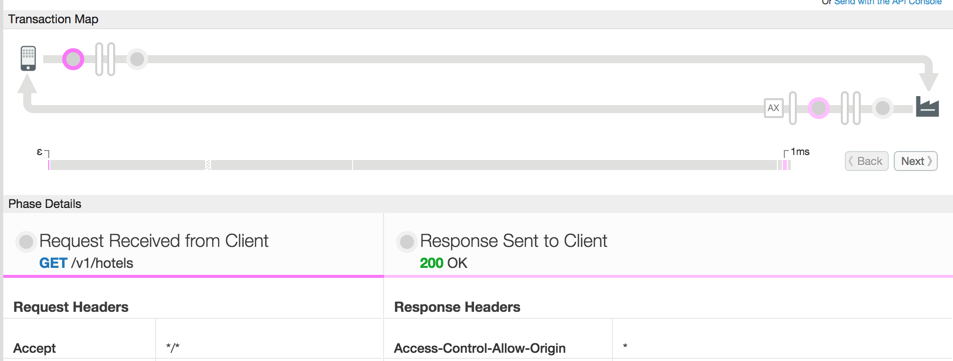
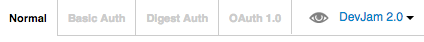
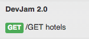

**Lab 3 - Building a simple API Proxy**

**Overview**

Apigee Edge enables you to expose APIs that can be easily consumed by
developers who build apps. You expose APIs on Apigee Edge by building
API proxies that act as managed 'facades' for backend services.

You expose APIs on Apigee Edge by implementing *API proxies*. An API
proxy is a bundle of XML configuration files and code (such as
JavaScript and Java) that implements the facade for your backend HTTP
services. API proxies decouple the developer-facing API from your
backend services, shielding developers from code changes and enabling
you to innovate at the edge without impacting internal applications and
development teams. As development teams make backend changes, developers
continue to call the same API without any interruption.

API proxies manage request and response messages using a 'pipeline'
processing model that defines 'Flows'. To customize the behavior of your
API, you attach Policies to request and response Flows.

In an API proxy configuration, there are two types of endpoints:

-   **ProxyEndpoint:** This configuration manages interactions with apps
    > that consume your API. You configure the ProxyEndpoint to define
    > the URL of your API. You usually attach Policies to the
    > ProxyEndpoint to enforce security, quota checks, and other types
    > of access control and rate-limiting.

-   **TargetEndpoint:** This configuration manages interactions with
    > your backend services on behalf of consumer apps. You configure
    > the TargetEndpoint to forward request messages to the proper
    > backend service. You usually attach Policies to the TargetEndpoint
    > to ensure that response messages are properly formatted for the
    > app that made the initial request.

You can visualize API proxies as shown by the graphic below. A basic
request and response exchange between an app (HTTP client) and a backend
service is managed in an API proxy by a ProxyEndpoint and
TargetEndpoint.

{width="5.046875546806649in"
height="1.9815452755905512in"}

You can build API proxies using the Apigee Edge management UI. You can
also implement API proxies on your local machine, and then import them
to your organization on Apigee Edge. For an overview of the UI and API,
see [Using the Apigee Edge development
environment](http://apigee.com/docs/api-services/content/using-apigee-edge-development-environment).

**Objectives**

In this lab you will get familiar with the Apigee Edge Management UI by
updating the API Proxy that we created in Lab 1 to function as a simple
passthrough facade to the GET API for the ‘hotels’ data collection in
API BaaS. After creating the facade you will also learn how to deploy
and undeploy a proxy. Finally you will also learn how to use the Trace
capabilities in the Management UI.\
\
**Some API teams build APIs using a Design-First approach where they
start with creating a Swagger document – this is what we did in lab 1
and what we will use as the basis for our API Proxy. An alternative
approach is** **to use a Build-First approach that starts with building
an API proxy directly in Apigee Edge. **

**Prerequisites**

-   Labs 1 & 2 are completed

-   Postman tool installed and ‘DevJam 2.0’ bundle imported.

**Estimated Time: 15 mins**

1)  **Open the API Proxy that we created in lab 1**.

    a.  Open up a browser tab and log in to http://enterprise.apigee.com

    b.  From the Organization drop-down in the top-right corner, select
        the organization assigned to you.

    c.  From the Environment drop-down, select ‘test’

    d.  From the main menu, select APIs → API Proxies

> {width="3.1041666666666665in"
> height="0.9496041119860017in"}

a.  Click on the link to your API Proxy **{yourinitials}\_hotels**

b.  Review the information on the resulting API Proxy page

> {width="5.525403543307086in"
> height="3.080291994750656in"}

1)  **Deploying and Undeploying a Proxy** to a given environment from
    the Management UI is simple too.

    a.  Click on the ‘Deploy’ drop-down on the API Proxy page

> {width="2.2656255468066493in"
> height="0.9515627734033246in"}

a.  Notice that the proxy we just created is deployed to the ‘test’
    environment

b.  Click on the ‘test’ environment name. This un-deploys the proxy from
    the ‘test’ environment

c.  Click on the ‘Deploy’ drop-down again and select the
    ‘test’ environment. This re-deploys the proxy to the ‘test’
    environment

<!-- -->

1)  **Tracing the execution of a proxy** can also be done easily from
    the Management UI. This is a very powerful capability of the product
    since it makes it easy to troubleshoot and monitor API proxies
    running on Apigee Edge. Trace lets you probe the details of each
    step through an API proxy flow.

    a.  From the ‘**{your\_initials}\_hotels**’ API Proxy page, click on
        the ‘**Trace**’ tab

> {width="2.2031255468066493in"
> height="0.48450459317585304in"}

a.  Once on the ‘**Trace**’ tab, pick the correct environment from the
    ‘**Deployment to Trace**’ drop-down. In your case there should only
    be one environment to pick - ‘**Environment test, Revision 1**’

> {width="4.322916666666667in"
> height="0.78125in"}

a.  Click on the ‘**Start Trace Session’** button

b.  After the trace session starts, click on the ‘**Send**’ button in
    the ‘**Send Requests**’ section

> {width="4.729166666666667in"
> height="0.42363626421697287in"}

a.  You will see the a transaction appear in the ‘Transactions’ section
    and a visual representation of the executed proxy flow in the
    ‘Transaction Map’ section

b.  The ‘Transaction Map’ is interactive - click on the various
    execution steps within the flow and review the information provided
    in the ‘Phase Details’ section. You will notice that for each step
    information such as headers, variables, payload, properties and
    other relevant information is available. This helps you quickly
    understand exactly what is happening within the proxy flow.

> {width="3.9114588801399823in"
> height="1.473494094488189in"}

a.  At this point, we will start to use the ‘Postman’ tool as a client
    to invoke our proxy and continue to use ‘Postman’ throughout the
    rest of the labs.

    -   Launch ‘Postman’

    -   Select the ‘DevJam 2.0’ environment

> {width="4.416666666666667in"
> height="0.4375in"}

-   Open the ‘DevJam 2.0’ project

-   Select and send the ‘/GET hotels’ request

{width="1.5729166666666667in"
height="0.6979166666666666in"}

> Note : Please change the URL to point to your API proxy.

-   Review the response returned by the proxy. It should be the same
    response as the one you observed when using the ‘Trace’ tool in the
    Management UI

a.  Switch to the ‘Trace’ tab of the Apigee Edge Management UI and click
    on the ‘Stop Trace’ button

**Summary**

That completes this hands-on lesson. Simple and quick, but you learned
the fundamentals of how to work with an API Proxy, how to deploy and
undeploy it to/from an environment, and how to trace the proxy flow.
Throughout the rest of the hands-on labs you will be working with this
Management UI to add policies to proxies, testing and tracing these
proxies, and learning about the power of the Apigee Edge platform.
