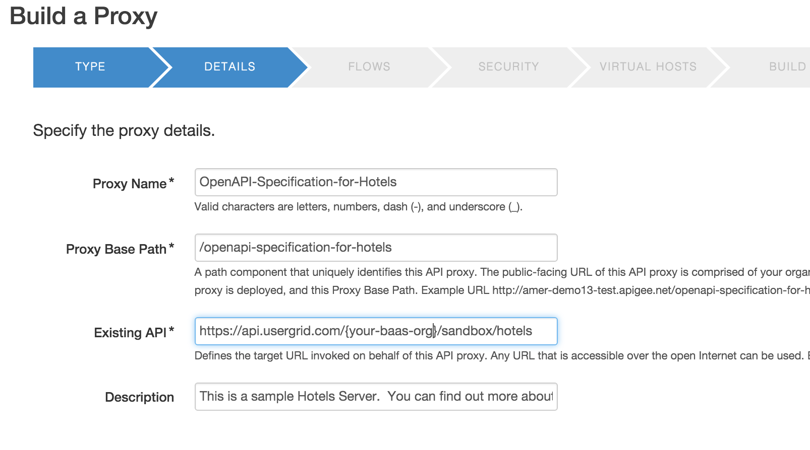
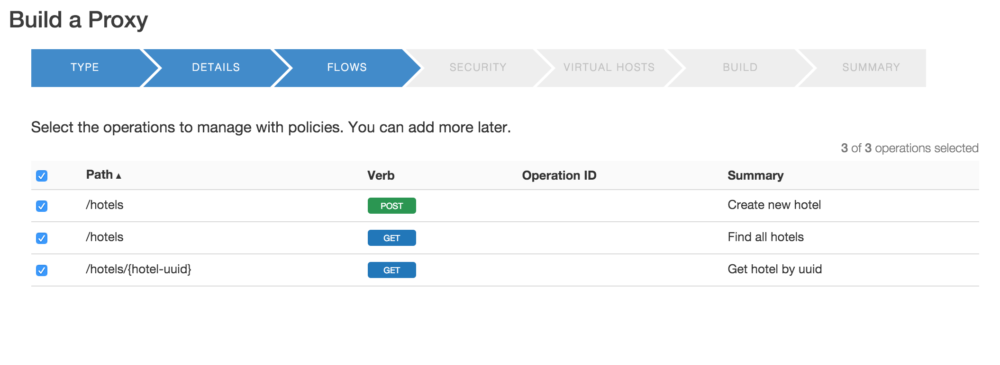
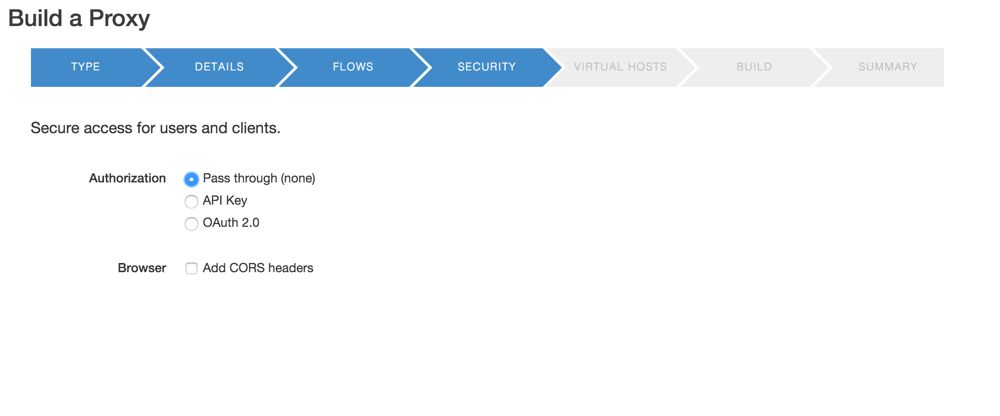
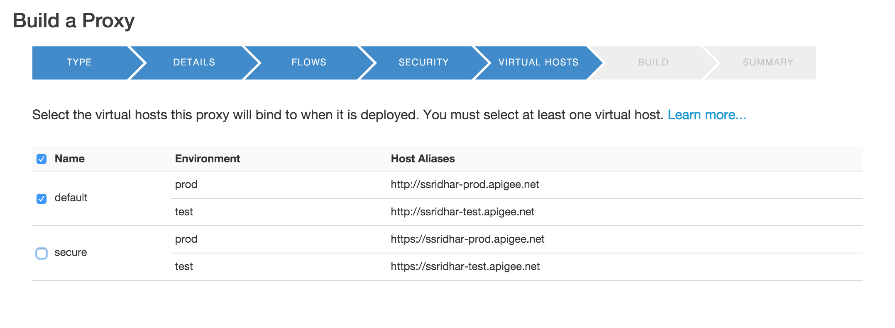
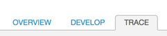
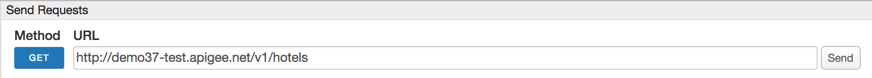

#Lab 1 – Design and Build a simple API Proxy

##Overview

An API is an interface between the provider of some backend system(s)
who wants to expose a set of services and the consumers of those
services who want to do something with them. Adherence to a “contract”
or a clear understanding of what the requests and responses should look
like, makes life easier for all participants. In order to clearly
communicate the terms of that contract, the industry has created a few
formats for describing an API, the most popular of which is called
[*OpenAPI Specification*](http://swagger.io/) (formerly known as
Swagger).

By designing your API in OpenAPI spec, you allow the API developer and
the API consumer to both do their jobs and meet successfully in the
middle without unpleasant surprises.

Apigee is a key contributing member of and has partnered with a number
of other companies to help drive the OpenAPI spec and contribute open
source software to the community.

This is a partial list of the tools that Apigee has created,
open-sourced, or contributed to related to API-first design, OpenAPI
spec, or API deployment:

-   [*http://apistudio.io*](http://apistudio.io/) - In-browser OpenAPI
    > IDE including live documentation, code generation, mocking, and
    > cloud hosting.

-   [*https://github.com/apigee-127/a127-documentation/wiki*](https://github.com/apigee-127/a127-documentation/wiki) -
    > A toolkit for modeling and building rich, enterprise-class APIs in
    > Node.js on your laptop.

-   [*http://editor.swagger.io*](http://editor.swagger.io) - 
    > This editor is the basis for the ones used in the above two projects, but it
    > also includes code generators for a number of other languages.

* Review the OpenAPI specification hosted
    [*here*](http://playground.apistudio.io/9dd084db-7136-460e-8fe8-bde4ecafdc93/#/)

URL:
[**http://playground.apistudio.io/9dd084db-7136-460e-8fe8-bde4ecafdc93/\#/**](http://playground.apistudio.io/9dd084db-7136-460e-8fe8-bde4ecafdc93/#/)
* On the right side of the editor, in the documentation view, scroll
    down to **GET /hotels** in the Responses section and click the
    **Try this operation** button:

* Click on Send Request and observe the response

Now that we have the
OpenAPI specification, let's create an API proxy in Apigee Edge.

Apigee Edge enables you to expose APIs that can be easily consumed by
developers who build apps. You expose APIs on Apigee Edge by building
API proxies that act as managed 'facades' for backend services.

You expose APIs on Apigee Edge by implementing *API proxies*. An API
proxy is a bundle of XML configuration files and code (such as
JavaScript and Java) that implements the facade for your backend HTTP
services. API proxies decouple the developer-facing API from your
backend services, shielding developers from code changes and enabling
you to innovate at the edge without impacting internal applications and
development teams. As development teams make backend changes, developers
continue to call the same API without any interruption.

API proxies manage request and response messages using a 'pipeline'
processing model that defines 'Flows'. To customize the behavior of your
API, you attach Policies to request and response Flows.

In an API proxy configuration, there are two types of endpoints:

-   **ProxyEndpoint:** 
    > This configuration manages interactions with apps
    > that consume your API. You configure the ProxyEndpoint to define
    > the URL of your API. You usually attach Policies to the
    > ProxyEndpoint to enforce security, quota checks, and other types
    > of access control and rate-limiting.

-   **TargetEndpoint:** 
    > This configuration manages interactions with
    > your backend services on behalf of consumer apps. You configure
    > the TargetEndpoint to forward request messages to the proper
    > backend service. You usually attach Policies to the TargetEndpoint
    > to ensure that response messages are properly formatted for the
    > app that made the initial request.

You can visualize API proxies as shown by the graphic below. A basic
request and response exchange between an app (HTTP client) and a backend
service is managed in an API proxy by a ProxyEndpoint and
TargetEndpoint.

You can build API proxies using the Apigee Edge management UI. You can
also implement API proxies on your local machine, and then import them
to your organization on Apigee Edge. For an overview of the UI and API,
see [Using the Apigee Edge development
environment](http://apigee.com/docs/api-services/content/using-apigee-edge-development-environment).

##Objectives

In this lab you will get familiar with the Apigee Edge Management UI by
creating a simple passthrough facade to the GET API for the **hotels**
data collection in API BaaS. After creating the facade you will also
learn how to deploy and undeploy a proxy. Finally you will also learn
how to use the Trace capabilities in the Management UI.

Some API teams build APIs using Design-First approach where they start
with creating a Swagger (OpenAPI) document. Some of them happen to have
many existing back-end services/APIs & they prefer a Build-First
approach which starts with building an API proxy in Apigee Edge. This
lab shows you how to build proxies.

##Prerequisites

- Postman tool installed and **DevJam 2.0** bundle imported.

###Estimated Time: 15 mins

* Creating an API Proxy for a backend service that you want to expose requires you to provide the network address for the backend service, along with some information that API Services uses to model the API that will be exposed to developers.
    * Open up a browser tab and log in to [*http://enterprise.apigee.com*](http://enterprise.apigee.com)
    *  From the Organization drop-down in the top-right corner, select the organization assigned to you.
    *  From the Environment drop-down, select **test**
    *  From the main menu, select APIs → API Proxies
    
 

    * To create a new API proxy, select the + API Proxy button to add a new proxy.

 

    * On the New API Proxy form that is displayed, provide information needed to generate an API proxy. Select **Reverse Proxy** and click on **Use OpenAPI** -

 

    * Click on *apply*

 

 URL:
[*http://playground.apistudio.io/9dd084db-7136-460e-8fe8-bde4ecafdc93/spec*](http://playground.apistudio.io/9dd084db-7136-460e-8fe8-bde4ecafdc93/spec)

    * Enter Proxy details

>
> Existing API:
> **https://api.usergrid.com/{your-BaaS-org}/sandbox/hotels**
>
> Proxy Name: **{your\_initials}\_hotels**
>
> Project Base Path: **/v1/{your\_initials}\_hotels**
> 
**Note**: Replace **{your-BaaS-org}** with the actual name of your API BaaS organization. Replace **{your-initials}** with the initials of your name.

    * Select **all operations** from the OpenAPI spec to proxy

    * Do not apply any security policy for the proxy (this will be done in the later labs)

    * Select the **default** virtual host (http only)

    * Select environments to deploy **test** and click **Build and Deploy**

* **Deploying and Undeploying a Proxy** to a given environment from the Management UI is simple too.
    * Click on the **Deploy** drop-down on the API Proxy page.

    * Notice that the proxy we just created is deployed to the **test** environment.
    * Click on the **test** environment name. This undeploys the proxy from the **test** environment
    * Click on the **Deploy** drop-down again and select the **test** environment. This re-deploys the proxy to the **test**
    environment

*  **Tracing the execution of a proxy** can also be done easily from the Management UI. This is a very powerful capability of the product since it makes it easy to troubleshoot and monitor API  proxies running on Apigee Edge. Trace lets you probe the details of each step through an API proxy flow.
    *  From the **{your\_initials}**\_hotels API Proxy page, click on the **Trace** tab.

    * Once on the **Trace** tab, pick the correct environment from the **Deployment to Trace** drop-down. In your case there should only be one environment to pick - **Environment test, Revision 1**.

    * Click on the **Start Trace Session** button.
    * After the trace session starts, click on the **Send** button in the **Send Requests** section.

    * You will see the a transaction appear in the **Transactions** section and a visual representation of the executed proxy flow in the **Transaction Map** section.
    * The **Transaction Map** is interactive - click on the various execution steps within the flow and review the information provided in the **Phase Details** section. You will notice that for each step information such as headers, variables, payload, properties and other relevant information is available. This helps you quickly understand exactly what is happening within the proxy flow.

    * At this point, we will start to use the **Postman** tool as a client to invoke our proxy and continue to use **Postman** throughout the rest of the labs.
        * Launch **Postman**
        * Select the **DevJam 2.0** environment.

        * Open the **DevJam 2.0** project
        * Select and send the **/GET hotels** request.

**Note** : Please change the URL to point to your API proxy.

Review the response returned by the proxy. It should be the same response as the one you observed when using the **Trace** tool in the Management UI. Switch to the **Trace** tab of the Apigee Edge Management UI and click on the **Stop Trace** button.

##Summary
That completes this hands-on lesson. Simple and quick, but you learned the fundamentals of how to create an API Proxy, how to deploy and
undeploy it to/from an environment, and how to trace the proxy flow. Throughout the rest of the hands-on labs you will be working with this Management UI to add policies to proxies, testing and tracing these proxies, and learning about the power of the Apigee Edge platform.
