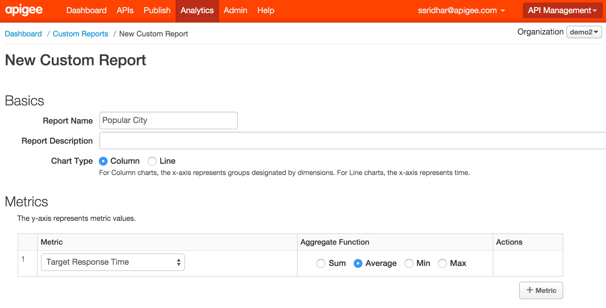
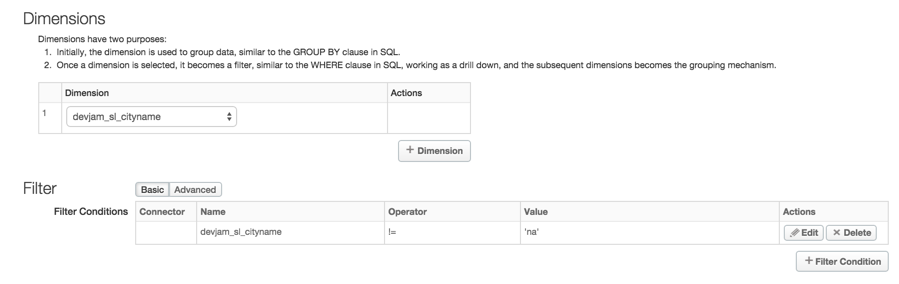
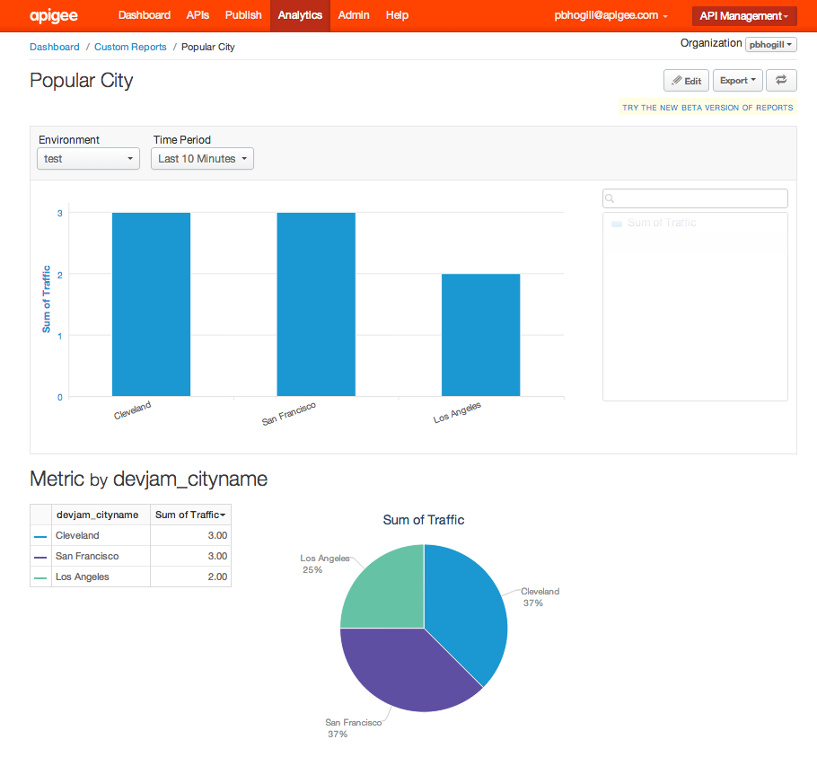

*Lab 4 - Creating Custom Reports*


**Overview**

Let's say your API has gained wide adoption. It's popular. You have
attracted a number of talented, creative app developers and people are
downloading and installing their apps. Obviously, the API team is very
interested in how the API is performing, how it's being used, and how to
plan for improvements. Apigee Edge Analytics Services collects and
analyzes a wealth of information that flows through APIs. This
information is gathered, analyzed, and provided to you immediately, in
real time. In this lab we will see how you can extend the Edge analytics
services by create dimension and metrics and use them in Custom reports.
We will have to use Statistics collector policy to create custom
dimensions and metrics.


**Statistics Collector policy**
Enables you to collect statistics for data in a message, such as
product ID, price, REST action, client and target URL, and message
length. The data can come from flow variables predefined by Apigee or
custom variables that you define. The statistics data is passed to the
analytics server, which analyzes the statistics and generates reports.
You can view the reports by using the Edge management UI or Edge API.

**Custom Reports**
There are several Out-of-the-box, “Standard” reports that are
automatically provided for every Edge organization. They track several
critical operational metrics, such as proxy response time, target
response time, cache performance, error rates, and others. An API
Publisher can create custom reports to augment the standard reports. By
adding custom reports, you can create a set of charts that provide
insight into the exact aspects of your API program that you wish to
analyze.


**Objectives**

The objective of this lesson is to get you familiar with Apigee’s
Statistics collector policy and learn how to create custom reports in
Edge.

**Prerequisites**

- Lab 2 is completed

**Estimated Time: 45 mins**

Now we will enhance the proxy to start collecting some statistics from
the response payload. As part of this we will add a couple of policies
including a Statistics Collector to the existing proxy that we have just
created. Let's add a policy **-**

a.  Go to the Apigee Edge Management UI browser tab

b.  Go to the ‘{your\_initials}\_hotel’ proxy’s ‘Develop’ tab

c.  Click on ‘Get Hotel by uuid’

d.  Click on “**+ Step**” on the Response Flow

> 

e.  Select the ‘Extract Variables’ policy with the following properties:

    i.  Policy Display Name: **Extract Variables**

    ii. Policy Name: **Extract-Variables**

> 

f.  For the ‘Extract Variables’ policy, change the XML configuration of
    the policy as follows :

  ```
  <?xml version="1.0" encoding="UTF-8" standalone="yes"?>
  <ExtractVariables async="false" continueOnError="false" enabled="true" name="Extract-Variables">
  <DisplayName>Extract Variables</DisplayName>
  <JSONPayload>
  <Variable name="hotelRating">
  <JSONPath>\$.entities\[0\].hotelRating</JSONPath>
  </Variable>
  <Variable name="hotelCity">
  <JSONPath>\$.entities\[0\].city</JSONPath>
  </Variable>
  </JSONPayload>
  <Source clearPayload="false">response</Source>
  </ExtractVariables>
  ```

*(You can find the policy xml*
[**here**](https://gist.github.com/prithpal/ab704e5dea4a77b97497)*.
Click the “Raw” button and copy/paste into your policy editor).*

The JSONPath expression above extracts city & rating information from
the response returned the hotels API and assigns it to variables
“hotelRating” and “hotelCity” respectively.

f.  Select the ‘Statistics Collector’ policy with the following
    properties:

    i.  Policy Display Name: **Statistics Collector**
    ii. Policy Name: **Statistics Collector**

**Note :** Make sure you have Statistics collector policy after
Extract Variable policy on the response path (as shown below).

> 

a.  For the ‘Statistics Collector’ policy, change the XML configuration
    of the policy as follows :

  ```
  <?xml version="1.0" encoding="UTF-8" standalone="yes"?>
  <StatisticsCollector async="false" continueOnError="false" enabled="true" name="Statistics-Collector">
  <DisplayName>Statistics Collector</DisplayName>
  <Properties/>
  <Statistics>
  <Statistic name="devjam\_{your\_initials}\_city" ref="hotelCity" type="String">NO\_CITY</Statistic>
  <Statistic name="devjam\_{your\_initials}\_rating" ref="hotelRating" type="Float">NO\_RATING</Statistic>
  </Statistics>
  </StatisticsCollector>
  ```

*(You can find the policy xml*
[**here**](https://gist.github.com/prithpal/28dd0378ac9bdb88d922)*.
Click the “Raw” button and copy/paste into your policy editor).*

You will see devjam\_**{your\_initials}**\_city, as a dimension in a
custom report, whereas devjam\_**{your\_initials}**\_rating as a
metric.

a.  Once the two policies have been added and you have clicked “Save”.
  **Testing the Statistics collector policy by generating some load**

1.  Start a Trace session for the ‘{your\_initials}\_hotels’ proxy

2.  Send a ‘/GET hotels’ request from Postman. This will return the list
    of hotels from BaaS collection.

3.  Copy the UUID of any hotel entity

4.  Append that the copied UUID to the URL of ‘/GET hotels’ request and
    send another request from Postman. For eg -

http://**{org}-{env}**.apigee.net/v1/**{your\_initials}**\_hotels/800bacba-14d0-11e5-a120-5d76c8c39ab3

NOTE : replace your org, env and **{your\_initials}**\_hotels with
your Edge Org and Environment and proxy names.

Bump up the “rate” of Spike Arrest to some arbitrarily high number so
you can run a few requests through.

```
<?xml version="1.0" encoding="UTF-8" standalone="yes"?>
<SpikeArrest async="false" continueOnError="false" enabled="true"name="Spike-Arrest-10pm">
<DisplayName>Spike Arrest 10pm</DisplayName>
<Properties/>
<Identifier ref="request.header.some-header-name"/>
<MessageWeight ref="request.header.weight"/>
<Rate>1000pm</Rate>**
</SpikeArrest>
```

1.  Review the Trace for the proxy and notice that “Extract Variables”
    and “Statistics Collector” policies get executed only for the GET
    request with UUID.

2.  Try to invoke ‘/GET hotels’ with different (valid and invalid)
    UUID combinations.

**Creating Custom Reports**

1.  Login to the Apigee Edge Management User Interface (Management UI).
    On the top menu, click on the Analytics item and then click
    on “Reports”. When on that page click on the '+ Custom Report'
    button on the top right.

> 

2.  Define the custom report - Enter the values as indicated below and
    click on the blue “Save” button.

> 

> 

a.  Report Name: {your initials} Popular Destination

b.  Report Description: This report shows the most popular
    > destination queried.

c.  Chart Type: Column

d.  Aggregation Interval: Per-Minute

e.  Environment: {your env} test or prod

f.  Metrics: Traffic - Sum of traffic Target Response Time - Average

> This will create a multidimensional report.

a.  Dimensions: devjam\_**{your\_initials}**\_city\
    This is the name of the variable which we created in earlier using
    the Statistics Collector policy to capture the city name from the
    response payload. Using the Statistics Collector policy, you can
    capture variables from the request or response, including headers,
    body, and other attributes and have the analytics engine start
    harvesting these values for you. Generally these variables will
    show up under the “custom dimensions” category in the
    Drilldown drop-down. Notice that there are many “standard”
    dimensions which Edge collects for you, for every request,
    including response time, payload size, and so on.

b.  Filters: devjam\_**{your initials**}\_cityname != ‘na’\
    (this will ensure only traffic that used this dimension will
    display on your report)

c.  You should now see something like the following:

> 

2.  There probably is not much data that Edge Analytics has collected,
    > so you many not see anything meaningful quite yet. But let’s
    > generate some sample query data.

    a.  Switch to the browser window tab where you have your Postman
        client

    b.  Send a ‘/GET hotels’ request from Postman. This will return the
        list of hotels from BaaS collection.

    c.  Copy the UUID of any hotel entity

    d.  Append that the copied UUID to the URL of ‘/GET hotels’ request
        > and send another request from Postman.

For eg -
http://**{org}-{env}**.apigee.net/v1/**{your\_initials}**\_hotels/800bacba-14d0-11e5-a120-5d76c8c39ab3

NOTE : replace your org, env and **{your\_initials}**\_hotels with
your Edge Org and Environment and proxy names.

a.  Invoke ‘/GET hotels’ appending a different UUID (with a hotel from
    another city).

Bump up the “rate” of Spike Arrest to some arbitrarily high number so
you can run a few requests through.

```
<?xml version="1.0" encoding="UTF-8" standalone="yes"?>
<SpikeArrest async="false" continueOnError="false" enabled="true"
name="Spike-Arrest-10pm">
<DisplayName>Spike Arrest 10pm</DisplayName>
<Properties/>
<Identifier ref="request.header.some-header-name"/>
<MessageWeight ref="request.header.weight"/>
<Rate>1000pm</Rate>**
</SpikeArrest>)
```

2.  Go back to the Management UI and navigate to Analytics / Reports
    from the top menu.

    a.  Click on the “Popular Destination” report.

    b.  Edge Analytics performs aggregation on a regular interval,
        asynchronously with respect to incoming API requests.
        Therefore, you may have to wait a bit to see the data appear
        in the chart. After a cycle of aggregation occurs, you will
        see:

> 

c.  Add a filter ((devjam\_cityname ne 'null') and (devjam\_cityname ne
    > '(not set)')) in your custom report. This will remove any unknown
    > cities from the report .

The final configuration of the custom report will look like the
following :

> {width="6.5in" height="4.458333333333333in"}

**Summary**

In this exercise, you learnt about the statistics collector policy &
custom reports in Apigee Edge. You also added the custom report along
with other reports to a custom dashboard. Please visit the
[*documentation*](http://apigee.com/docs/api-services/content/analytics-dashboards)
to see the different kinds of operational reports and dashboards that
are available to you.

**Bonus Section**

-   Review out of the box reports provided by Apigee Edge on
    -   Proxy performance
    -   Cache performance
    -   Backend performance
    -   Latency reports
    -   Traffic reports on the Geo-map
    -   Developer Engagement
    -   Error Analysis reports


