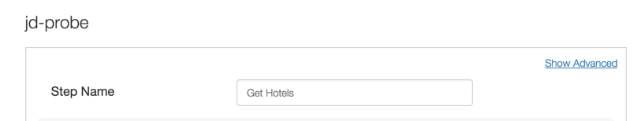

**Lab 8 - Monitoring your APIs’ Health**

**Overview**

As a digital company, you understand that APIs are critical for your
business. You want your APIs to function as expected and you want to be
notified of any anomalies the moment they happen so that you can
expedite the resolution.

Apigee's **API Health** service is designed to help organizations detect
and prevent the potential consequences of bad API performance such as
poor application experience, user frustration, and lost revenue. API
Health helps you answer two very important questions by collecting a
standard set of vitals: Are my APIs alive? How are they behaving? With a
network of probes deployed across globally distributed data centers in
the cloud, API Health continually measures the success rate and
performance of APIs, and alerts DevOps teams to any failures or
slowdowns of their APIs.

**Objectives**

The objective of this lesson is to get you familiar with Apigee’s API
Health service.

**Prerequisites**

-   Lab 7 is completed

**Estimated Time: 30 mins**

In this lab we will monitor your hotels API proxy and generate alerts
whenever there is a latency anomaly or failures using assertions like
status code. Let’s get started -

1.  Login to API Health -
    [*https://health.apigee.com/*](https://health.apigee.com/) with your
    Apigee Edge credentials.

2.  Select the Organization.

3.  Click ’Add Probe’ to add a new monitoring probe to your API.

1.  For creating a probe, let’s use the following values

-   Probe Name : {your\_initials}\_probe

-   Step Name : Get Hotels

-   URI : http://{org}-{env}.apigee.net/v1/**{your\_initials}\_hotels**

> Note : Replace org, environment & API proxy values before you Save.

-   Http Method : Get

-   Response &gt; Asset &gt; HTTP Code - 2XX

1.  Click on “Next”.

2.  Define Alerts by configuring the following values :

-   Run Every : 30 seconds

-   Raise Alert : enable “If Failure exceeds” and set the value as 5
    consecutive times.

-   Notification Destination : Choose Email and provide **your email
    address**.

1.  Click on “Next”.

2.  Select Run locations : Check all the four locations.

3.  Click on “I’m Done”.

1.  This will create a probe in API Health. You can view all your Probes
    from the API Health dashboard.

1.  As the Hotels API proxy is protected, all call will fail with 4xx
    errors and you will receive alerts (like the one below) on the
    configured email address.

1.  You can deactivate the probe, from API Health dashboard.

1.  **Viewing graphical reports on API Health** -

    -   By clicking a step name on the API Health dashboard, you're
        shown graphs of average response times and success rates for
        that step. At the top of the Reports window, you can also select
        other steps in the probe to view composite graphs of all steps.

-   By clicking a probe name on the API Health dashboard, you're shown
    composite graphs of average response times and success rates for all
    steps in the probe. You can also deselect steps to compare only the
    ones you want, and you can filter the view by time period and
    location the calls were made from.

> 
>
> 

**Summary**

That completes this hands-on lesson. In this lesson you learned about
the API monitoring service provided by Apigee. As an assignment
configure multiple probes and monitor your APIs.

**Bonus Section**

Now let's change the probe definition.

1)  Get OAuth Access Token - Please refer to “Lab 6 - Securing APIs
    (OAuth)” for instructions to obtain an Access token.

2)  Modify Probe (Set OAuth Access Token in Header) -

    a.  From the API Health Dashboard, click on Edit probe.

> 

a.  Click on “Show Advanced” link.

> 

a.  Under “Headers” section make the following entry -

> Header Name : Authorization
>
> Header Value : Bearer {Access\_Token}
>
> Note : Replace **{Access\_Token}** with the actual Access token you
> obtained in the previous step.
>
> 

1)  We will keep other configurations as it is. Click on Next and Save
    the probe.

2)  This probe should not generate any errors. You will notice errors
    when the access token expires.

